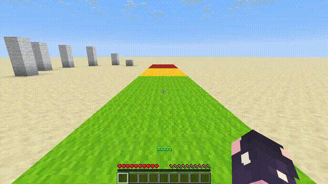
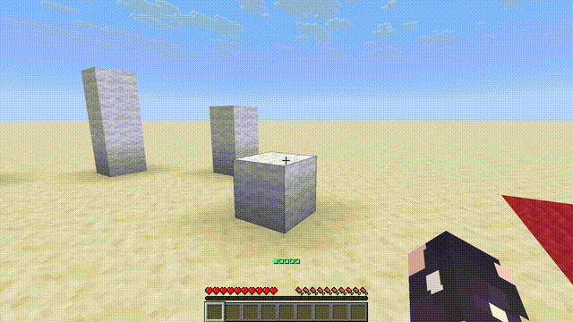

# Fatigue system

This datapack adds a fatigue mechanic for sprinting in Minecraft. 

By default, you have 3 seconds of sprinting and 3 seconds of recovery.



---

If the fatigue bar is maxed out, you will switch to a walking state.



---

## Changing the fatigue timer

To change the fatigue timer:
1) Go to `/data/dyostr/function/load.mcfuntion`
2) Change the value `60` to your desired time (1 second = 20 ticks).
```mcfunction
# /data/dyostr/function/load.mcfunction

scoreboard players set MAX_TIMER CONST_VALUES 60 

```
3) If you are already in the world, type `/reload` command to apply the changes.